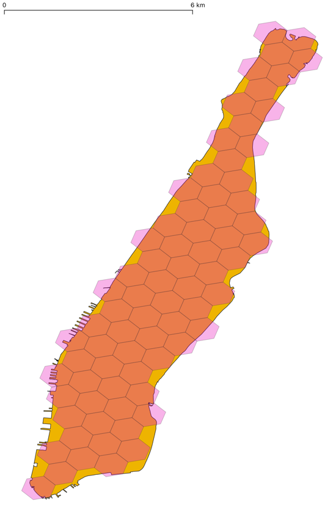
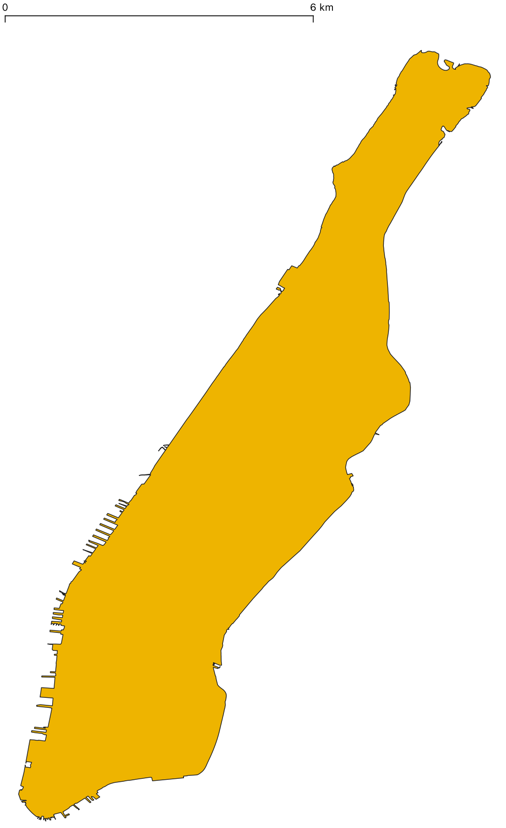
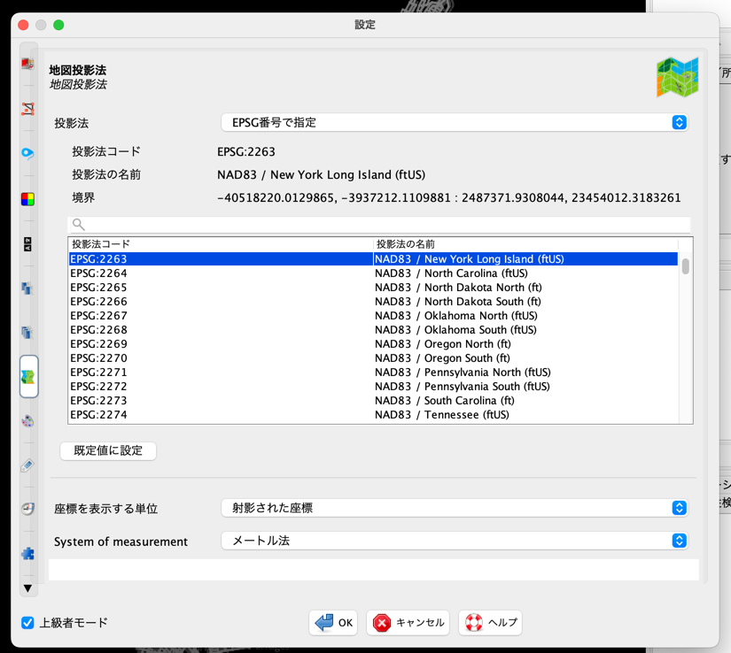

# 事前準備
手順としては[MATSim公式ページ](https://www.matsim.org/downloads/)の“Use MATSim as a programmer out of an IDE”に従って、installの1.~5.までを実行。  
IDEに関しては[eclipse](https://www.eclipse.org/downloads/)をインストール。
### 私も教わりながらで
皆さんが手元で実行しやすい共有方法などに詳しいわけではなく、環境によって手順通りにいかない可能性が大いにあります。
プログラミングは自己流で進めてばかりいたので、「こうしたらよりスマート」など適時私に教えていただけたら嬉しいです。
# Mstudy1
### 対象地域
当初熊本市で考えていましたが、トリップのデータを何かしらの仮定をおいて生成するのもイマイチだと思ったので、オープンデータが豊富でかつ対象地域に選ばれることの多い、**マンハッタン島**にします。オープンデータのみを利用します。
### 本レポジトリーの解説
シミュレーションのインプットの生成を行います。（MATSimシミュレーションの準備）
`bash Mstudy1.sh`  
上のコマンドでシェルスクリプトを実行すると以下のファイルがまとめて実行されます。
1. NYCTaxi0.py: [NYC OpenDataの2013年のタクシーデータ](https://data.cityofnewyork.us/Transportation/2013-Yellow-Taxi-Trip-Data/7rnv-m532)からマンハッタン島の内々トリップのみを抽出するなど、条件を指定しています。  
app_tokenをHPで各自取得して追加すれば、制限なく一度に多くのデータをダウンロードできる。
2. NYCTaxi1.py: MATSimではシミュレーションの距離計算の単純化のため平面直角座標系にインプットデータを変換する必要があり、座標変換をしている。WGS84(epsg:4326)→epsg:2263
3. NYCHex0.py: マンハッタン島内に配置するタクシーの初期位置を決めるため、境界内に中心点が含まれるヘキサゴンを生成。

### dataについて
- Boundaries_manha.geojson: マンハッタン島の境界データ  
[NYC OpenData](https://data.cityofnewyork.us/City-Government/Borough-Boundaries/tqmj-j8zm)から境界データをgeojsonでダウンロードし、マンハッタン島のみに少々整形。

- Boundaries_manha.poly: Boundaries_manha.geojsonを.polyに変換したファイル。[このツール](https://github.com/shanghuiyang/geojson2poly)を利用。osmosisにおいてマンハッタン島内のosmデータを抽出するのに.polyファイルが必要なため。

# Mstudy2
### ネットワークデータの用意（osmを用いた一例）
### ツールのインストール
1. osmデータを加工するのに用いる[osmosis](https://github.com/openstreetmap/osmosis/releases/tag/0.48.3)をインストールしてパスを通す。
2. osmデータをMATSimに簡単に変換するmatsimプラグインのある[JOSM（testedでもlatestでも大丈夫なはず）](https://josm.openstreetmap.de/)をダウンロード。
### データのダウンロードとosmosisでの加工
`bash Mstudy2.sh` 
1. NYC州のosmデータをダウンロード（http://download.geofabrik.de/north-america/us/new-york.html）
2. osmosisを用いて、Boundaries_manha.poly内のosmデータのみを抽出し、特定の道路種別のみを抽出。[osmの道路種別一覧](https://wiki.openstreetmap.org/wiki/JA:Key:highway)
### JOSMでの加工
ダウンロードしたJARファイルをダブルクリックなどして、JOSMを実行する。  
Settingsから、地図投影法を変換先のepsg:2263に変更をし、プラグインにおいてmatsimをダウンロード。

manhattan.osm.pbfを開き、Convert to MATSim layerでMATSim用のネットワークデータに変換し、保存。    
（この際、matsimプラグインのデフォルト値（変更可能）に基づき、情報のないリンクはそのリンク種別に応じた交通容量や制限速度が与えられる。）

# Mstudy3
### 準備
面倒ですが  
Mstudy3/src/内の.javaファイルを事前に実行したRunMatsim.javaと同じフォルダにコピー。(コピー後にプロジェクトをRefresh）
Mstudy3/data/内のファイルをscenarios/equil/config.xmlと同じフォルダにコピー。
### インプットデータの生成
1. MakePlan.javaを実行して、2013年5月8日のタクシーのODに基づくplanファイルを生成。
2. RunCreateDrtMesh.javaを実行して、対象地域内に配置するタクシーの初期配置ファイルを生成。
### シミュレーションの実行
drtとdvrpモジュールが追加されたRunMATSimDRT.javaファイルを実行。
# Mstudy4
### MATSimについて質問を受けながら色々説明
inputファイル、outputファイル、MATSimのコード、[MATSim user guide](https://www.matsim.org/files/book/partOne-latest.pdf)を用いながら、私の知る限りで説明。
MATSimを用いて何がしたいかに合わせて説明。