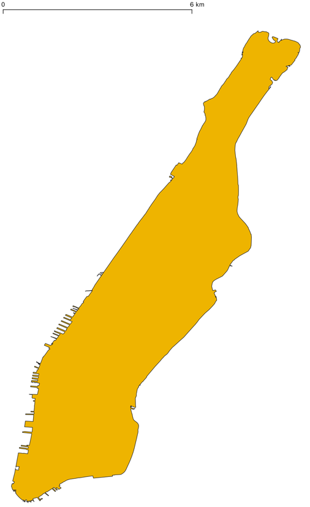

# Mstudy1
### 対象地域
当初熊本市で考えていましたが、トリップのデータを何かしらの仮定をおいて生成するのもイマイチだと思ったので、オープンデータが豊富でかつ対象地域に選ばれることの多い、**マンハッタン島**にします。
### 本レポジトリーの解説
シミュレーションのインプットの生成を行います。  
`bash Mstudy1.sh`  
上のコマンドでシェルスクリプトを実行すると以下のファイルがまとめて実行されます。
1. NYCTaxi0.py：[NYC OpenDataの2013年のタクシーデータ](https://data.cityofnewyork.us/Transportation/2013-Yellow-Taxi-Trip-Data/7rnv-m532)からマンハッタン島の内々トリップのみを抽出するなど、条件を指定しています。  
app_tokenをHPで各自取得して追加すれば、制限なく一度に多くのデータをダウンロードできる。WGS84(epsg:4326)→epsg:2263
2. NYCTaxi1.py：MATSimではシミュレーションの距離計算の単純化のため平面直角座標系にインプットデータを変換する必要があり、座標変換をしている。
3. NYCHex0.py：マンハッタン島内に配置するタクシーの初期位置を決めるため、境界内に中心点が含まれるヘキサゴンを生成。
   
### dataについて
- Boundaries_manha.geojson:マンハッタン島の境界データ  
[NYC OpenData](https://data.cityofnewyork.us/City-Government/Borough-Boundaries/tqmj-j8zm)から境界データをgeojsonでダウンロードし、マンハッタン島のみに少々整形。
<!---->

